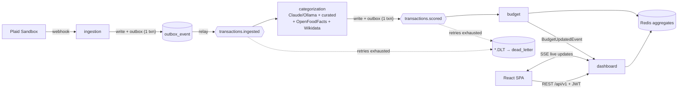

# Impact Budget

**A budgeting tool that categorizes spending by _impact_, not by type.**

[](https://github.com/YOUR-GH-USERNAME/impact-budget/actions/workflows/ci.yml)

Traditional budgeting apps tell you _how much_ you spent on "Groceries" or "Shopping."
Impact Budget tells you _where that money went_: what share of your discretionary spending
flowed to **local, independent businesses** versus multinational conglomerates, and how
**sustainable** your purchases were (natural fibers vs. synthetic fast fashion, organic vs.
conventional, B‑Corp vs. not). Then it lets you set goals — not just "save more," but "shift
30% of my discretionary spending to local businesses by Q4" — and tracks progress over time.

It's a financial mirror for your values.

## Live demo

**https://impact-budget.fly.dev** · sign in with **`demo@impactbudget.app`** / **`demopass123`**
(or hit "Explore the demo account"). The demo user is seeded with a few months of sample
spending. See [DEPLOY.md](DEPLOY.md) to run your own.

<!-- Add a dashboard screenshot / GIF at docs/dashboard.png and uncomment:

-->

---

## Why this project exists

A portfolio project demonstrating senior backend engineering end‑to‑end: real third‑party
integration, an event‑driven pipeline with delivery guarantees, an LLM‑powered service,
multi‑tenant auth, caching, distributed tracing, real‑time push, and a real test suite — all
wired into one runnable, deployable system.

The genuinely hard problem isn't the plumbing; it's **where the impact scores come from**.
"Is `TST*SQ*LOCAL COFFEE 12345` a local independent business?" is a real data problem, and it
gets the most design attention (see [The impact‑scoring design](#the-impact-scoring-design)).

## Senior-backend highlights

- **Multi-tenant auth** — stateless JWT (Spring Security), BCrypt, per-user data isolation.
  Every request is scoped to the token's subject; no client-supplied user id.
- **Transactional outbox** — domain writes and their events commit atomically, then a relay
  publishes to Kafka. No lost events between the DB commit and the broker.
- **Dead-letter queue** — retries with backoff, then routes to `<topic>.DLT` (never silently
  dropped), with a `dead_letter` audit table and a replay endpoint.
- **Distributed tracing** — Micrometer Tracing → OpenTelemetry → Tempo; one trace spans
  REST → outbox → Kafka → categorization → Kafka → budget.
- **Real-time** — Server-Sent Events push live dashboard updates as the pipeline scores.
- **Idempotent consumers** — unique keys + optimistic-race handling make at-least-once safe.
- **Verifiable module boundaries** — Spring Modulith test fails the build on a cross-module leak.

## Architecture

A **modular monolith** — one deployable Spring Boot app with clean module boundaries,
communicating over Kafka. Not microservices: the goal is a system that's impressive _and_
finishable and runnable. In production the React SPA is bundled into the app and served from
the same origin.



The headline event‑driven pattern is **one event, two consumers**: `transactions.ingested`
fans out to both the categorization engine and the budget projection.

### Modules

| Module           | Responsibility                                                              |
| ---------------- | -------------------------------------------------------------------------- |
| `auth`           | JWT auth, users, Spring Security config, per-user isolation                 |
| `ingestion`      | Plaid client, webhook listener, idempotent persistence, outbox enqueue      |
| `categorization` | Merchant normalization, LLM scoring, curated overrides, cache, swap ideas   |
| `budget`         | Goals, spend budget, monthly + per-category aggregates, scored projection   |
| `dashboard`      | REST API, Server-Sent Events stream, recommendations for the React frontend |
| `common`         | Shared events, Kafka config, transactional outbox + DLQ infrastructure      |

## Tech stack

- **Backend:** Java 17, Spring Boot 3.3, Spring Modulith (verifiable boundaries)
- **Security:** Spring Security, JWT (jjwt), BCrypt
- **Persistence:** PostgreSQL + Flyway migrations
- **Messaging:** Kafka (run locally as Redpanda) with a transactional outbox + dead-letter queue
- **Cache:** Redis (rebuildable; degrades gracefully)
- **Impact scoring:** pluggable — **Ollama** (local, free, default) or **Anthropic Claude**,
  plus free **Open Food Facts** (eco-score) + **Wikidata** (chain/parent-company) enrichment
  and a **B-Corp**-seeded curated table (final authority)
- **Banking data:** Plaid (Sandbox)
- **Observability:** Actuator + Micrometer + Prometheus + Grafana; OpenTelemetry tracing → Tempo
- **Frontend:** React + TypeScript (Vite) + Recharts, Server-Sent Events
- **API docs:** OpenAPI / Swagger UI (`/swagger-ui`)
- **Testing:** JUnit 5, Mockito, Testcontainers (Postgres/Kafka/Redis)
- **CI/CD:** GitHub Actions → GHCR image → Fly.io
- **Deploy:** one container (SPA bundled into the app), Docker Compose locally / Fly.io in prod

## Running locally

Everything runs via Docker Compose — the app image builds the frontend and backend inside the
container, so you don't need Maven or Node installed to run the stack.

```bash
docker compose up --build
```

**Demo data is seeded by default**, so the dashboard is populated on first boot. Open the app,
then sign in with **`demo@impactbudget.app`** / **`demopass123`** (or "Explore the demo account").

| Service           | URL                                          |
| ----------------- | -------------------------------------------- |
| App + UI          | http://localhost:8080                        |
| API docs (Swagger)| http://localhost:8080/swagger-ui/index.html  |
| Health            | http://localhost:8080/actuator/health        |
| Redpanda Console  | http://localhost:8085                        |
| Prometheus        | http://localhost:9090                        |
| Grafana           | http://localhost:3000 (admin/admin)          |
| Tempo (traces)    | via Grafana → Explore → Tempo                |

For real (non-fallback) impact scores — free & local — install [Ollama](https://ollama.com),
`ollama pull llama3.1`, and `ollama serve`. To use Claude instead, set `SCORING_PROVIDER=claude`
and `ANTHROPIC_API_KEY` in `.env`. With neither, scoring uses a neutral heuristic + the free
Open Food Facts / Wikidata / curated enrichment (the app still runs and scores).

### Frontend dev server (hot reload)

For UI work, run Vite separately (proxies `/api` to the backend on :8080):

```bash
cd frontend && npm install && npm run dev   # http://localhost:5173
```

### Deploying

See **[DEPLOY.md](DEPLOY.md)** — one Fly.io app (SPA bundled in) plus private Postgres, Redis,
and Redpanda apps, with CI that builds a GHCR image and deploys on green `main`.

## Observability

Actuator exposes health and Prometheus metrics; Grafana (auto-provisioned) has the **Impact
Budget** dashboard and a **Tempo** datasource for traces. Selected custom metrics:

| Metric | What it shows |
| --- | --- |
| `categorization_cache_total{result}` | merchant-score cache hit vs. miss (→ hit rate) |
| `categorization_scoring_total{source,provider}` | scoring by `llm` vs. `fallback`, by provider |
| `outbox_pending` | events committed but not yet published to Kafka (should trend to 0) |
| `dlq_pending` / `dlq_received_total{topic}` | dead-lettered events awaiting replay |
| `kafka_consumer_fetch_manager_records_lag` | consumer lag per client |

## Testing

```bash
mvn verify        # unit tests + Testcontainers integration test (needs Docker for the IT)
```

The suite has three layers:

- **Unit** (Mockito) — auth/JWT, outbox relay, DLQ record/replay, cache-hit path (no second
  LLM call), aggregate + budget-projection math, category resolver, recommendations.
- **Architecture** — a Spring Modulith test statically verifies module boundaries (no cycles,
  no reaching into another module's internals).
- **Integration** (Testcontainers) — an end-to-end test drives a transaction through the
  categorization and budget consumers (via the outbox) against real Postgres/Kafka/Redis.
  Container tests skip cleanly without Docker, so `mvn verify` is green locally and fully
  exercised in CI.

With **Colima**, point Testcontainers at its socket via `~/.testcontainers.properties`:
`docker.host=unix:///<your-home>/.colima/docker.sock` (Docker Desktop / Linux CI need no config).

## The impact‑scoring design

Merchant strings from banks are messy (`TST*SQ*LOCAL COFFEE 12345`). Scoring them is a
pipeline that keeps accuracy high and LLM cost low:

1. **Normalize & cache.** Strip processor prefixes (`TST*`, `SQ*`), store IDs, and trailing
   digits, then look up a `merchant_score` table. A hit means _no LLM call_ — most spending
   repeats the same merchants.
2. **Score on miss** with a pluggable provider (`categorization.scoring.provider`): **`ollama`**
   (default, local & free), **`claude`** (Anthropic `claude-opus-4-8`), or **`none`** (neutral).
   Every provider returns the same typed JSON (Local score, Sustainability score, a fixed
   **category** taxonomy, material flags, confidence), parsed/validated with Jackson; failures
   fall back to a neutral heuristic so the pipeline never blocks.
3. **Enrich sustainability with Open Food Facts** — a free, key‑less lookup overlays a real
   **eco‑score** and flags (`organic`, `fair-trade`) for food/CPG brands.
4. **Enrich local with Wikidata** — a free, key‑less lookup demotes the **local** score for
   known chains (parent‑org claim `P749` or a chain‑like description). So **Ben & Jerry's** ends
   up *high sustainability* (B‑Corp) but *low local* (owned by Unilever).
5. **Apply curated overrides** — the `curated_merchant` table is ground truth and _corrects_
   everything above (wins on conflict). Seeded from hand‑picked chains/brands (Flyway `V2`) plus
   an idempotent **B‑Corp** dataset loader.

The result is a mostly‑free pipeline that runs at **$0** with no external paid‑API dependency,
and every score records its `source` (`LLM`, `CURATED`, `FALLBACK`, `CACHE`, …) so a cached
result is visibly distinct from a fresh call.
